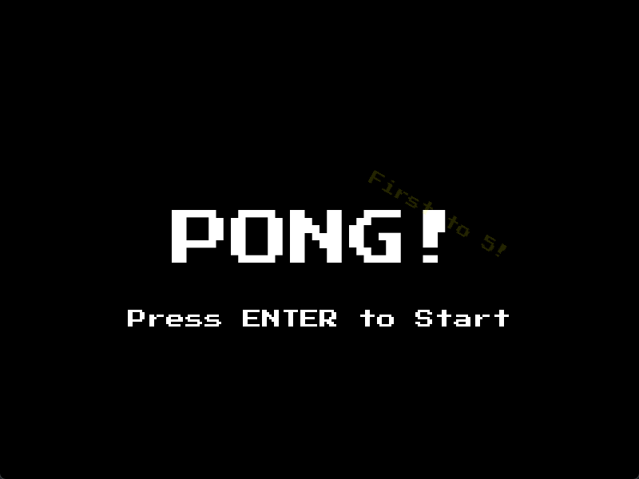

# PONG Game

This is a simple PONG game made with Python and Pygame.

## Installation

1. Clone the repository:
    ```sh
    git clone https://github.com/mayankkanti/pong-pygame.git
    cd pong-pygame
    ```

2. Install the required dependencies:
    ```sh
    pip install -r requirements.txt
    ```

3. Run the game:
    ```sh
    python src/main.py
    ```

## Demonstration



## End

Enjoy playing the game!